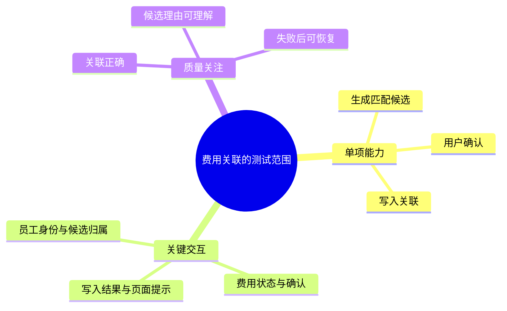

# 海盗派启发式测试：从理解需求到取得测试证据

拿到一份 PRD，你可能很快就能列出正常、异常和边界场景。更难的是判断：有没有漏掉关键业务？哪些问题值得先查？用例即使全部通过，能否说明用户的事情真的办成了？

这篇教程用一个票据助手的例子，带你和 AI 一起完成需求分析、测试设计、执行调查与风险更新。你会学到怎样使用 SFDIPOT、MFQ、PPDCS，也会知道什么时候不用它们。

阅读时不必记住全部 Skill 名称。通常从 `heuristic-testing` 开始，说明你的目标和已有材料即可。已有明确测试点、用例或代码时，也可以直接进入对应工作。

## 1. 先确定这次需要得到什么

“测试这个需求”可能意味着共同分析业务、编写用例，也可能意味着操作一个可运行系统。开始时说明你期待的结果，可以减少无效往返。

| 你当前的处境 | 可以怎样开始 |
| --- | --- |
| 刚拿到 PRD，不清楚测试范围 | “帮我分析这个需求，先结合业务和系统找出测试点与关键未知。” |
| 要交付一份可评审用例 | “基于已确认规则编写用例，列出数据、操作和预期，规则缺口单独标明。” |
| 已有实现，希望执行检查 | “在指定测试环境执行这些用例，保留实际结果和证据。” |
| 正在开发，需要单元测试 | “为这项业务规则编写单元测试，沿用项目框架并验证失败原因。” |

目标已经明确时，AI 应直接推进。只有答案会改变测试范围、规则或下一项工作时，才需要向你提问。你也可以要求先自主分析，再集中评审草案。

分析最好在开发前介入，提前暴露规则冲突、系统依赖和可观察性问题。开发中或上线后加入也有价值，只是可用依据和本轮目标不同。

### 安装与首次使用

这套工具包含 18 个 Skill，主入口会按需要调用其他组件。安装全集：

```bash
npx skills add jhjgoo/heuristic-testing-skills --skill '*'
```

安装到 Codex 全局目录：

```bash
npx skills add jhjgoo/heuristic-testing-skills --skill '*' --agent codex --global --yes
```

首次可以这样说：

```text
使用 heuristic-testing 分析这份 PRD。
目标是形成可评审的测试点和当前行动清单，本轮不执行测试。
请结合相关项目资料和代码；需要我判断的业务问题，用具体例子说明。
```

开始完整需求分析时，先选独立分析或项目任务。独立分析在对话或指定位置交付，也可参考相关代码；项目任务先收集项目资料、建立或补齐测试地图，再维护需求测试资产。你已说明工作方式时不用重复确认，尚未说明时 AI 应先问清。项目关联不明确时一起核实，避免把无关仓库纳入分析。

`npx skills update` 用于更新已安装的 Skill；Skill 内的 references 模板属于配套资料。新增独立 Skill 后，按仓库说明重新执行全集安装命令。

## 2. 理解这套方法的出发点

海盗派测试重视在有限时间里持续学习产品。一次测试可能验证了预期，也可能暴露一个此前没想到的问题；两者都会影响下一步安排。

**价值定方向，风险定焦点，证据定下一轮。**

假设一个功能的目标是减少人工录入。页面正常、接口成功，并不足以说明目标达成：用户如果仍要逐字段检查，工作量可能没有减少。反过来，一个出现频率很低的技术故障，也不必然比普遍发生的业务不便更值得先测。

测试中始终保留三个问题：

- 用户要完成什么，怎样才算办成？
- 哪些场景会让目标落空，或造成业务伤害？
- 我们已经取得什么证据，还有哪些结论不能下？

PRD 是起点。真实产品还包含上下游系统、角色权限、历史数据、配置变化、外部依赖和失败后的处理方式。启发式工具帮助你扩大观察范围，优先级则需要依据具体业务来判断。

后面会用到两个术语：

- **判断依据（oracle）**：凭什么说观察结果正确或可接受。它可能是已确认规则、接口协议、可人工核验的计算或其他可靠参照。现有代码输出不能自动成为目标需求的正确答案。
- **测试条件（TCON）**：需要验证的具体情况，例如“用户确认前，目标记录已经失效”。它比宽泛测试方向更具体，但还不等于步骤和数据都齐备的用例。

## 3. 跟着一个需求开始分析

以下票据助手及规则均为教学示例，不代表你的项目真实规则。把方法迁移到实际需求时，需要重新取得对应依据。

需求描述是：

> 用户上传票据后，系统识别内容并匹配已有费用；没有匹配项时建议新建，用户确认后写入费用系统。

### 3.1 先画出用户完成工作的过程

先尝试讲清楚一条正常业务：

员工提交票据，查看匹配结果，确认应关联的费用，系统完成关联，财务随后可以复核。

这条链路里，尚有很多不能只凭 PRD 猜测的问题：匹配哪些费用？员工与财务的权限是否不同？写入成功后从哪里确认？错误关联能否撤销？

AI 可以先调查已有流程、接口和代码，再用具体例子问：

> 两名员工都有同一天、同金额的费用记录。系统应如何确保票据只关联到允许操作的费用？目前在哪一层校验归属？

这个问题比“权限规则是什么”更容易回答，也会直接影响测试数据和观察位置。

假设本例的业务负责人确认：

- 员工只能关联自己的有效费用。
- 用户确认前，系统只提供建议，不修改费用记录。
- 错误关联可能影响财务复核；漏匹配主要增加人工查找。
- 候选失效后，旧确认不能继续写入，应提示重新选择。

这时，我们既找到了重要风险，也获得了可以设计测试的规则。

### 3.2 用项目证据消除可以查清的问题

如果需求属于当前项目，让 AI 检查相关 Spec、接口、数据模型、代码和已有测试。目的在于回答具体问题，例如：

- 候选查询是否已经过滤员工身份？
- 确认接口是否再次校验费用状态？
- 页面成功提示依据的是请求完成，还是业务写入完成？
- 已有测试覆盖了哪些行为，最近是否实际运行过？

代码能说明当前如何实现；产品或接口约定说明目标应如何工作。两者不一致时，要先考虑是否仍在开发、需求是否变化、版本是否正确，再判断是否存在缺陷。

关联不明确时，可以先确认是否结合当前项目。是否读取项目证据，与是否需要建立项目地图、保存文档，是不同的选择。

### 3.3 让澄清推动工作，而不是占满对话

适合交给你判断的是业务取舍、真实使用方式和材料没有回答的规则。能从代码或文档查清的事实，应由 AI 先调查。

先看哪些问题涉及重要业务后果、答案会改变多少测试、是否是其他问题的前提，再决定当前澄清主题。围绕主题把能够独立回答的问题放在一起；若一个答案会改变下一问，就先解决前一个。换题时应能说明原因。已交给负责人的高风险问题保留影响，其他明确工作继续，不必每查一个函数或整理一张表都回复“继续”。

每次回复应让你看出现在需要谁行动：需要你判断时突出问题及业务影响；AI 能继续调查时就直接做；本轮结束时说明产物、剩余边界和下一阶段。判断过程不必变成一长串固定问卷。

如果撤销规则还没确定，可以先设计正常关联和确认前失效的测试，将撤销留作待确认项。你提供新规则后，相关模型、测试点和用例应一起更新；与旧 PRD 的差异要有来源记录，避免下次又从旧假设开始。

## 4. 用启发式工具展开测试空间

三个工具各有用途：

| 工具 | 适合回答的问题 | 应得到的内容 |
| --- | --- | --- |
| SFDIPOT | 这个产品涉及哪些东西和关系，我们还漏了什么？ | 产品元素、关系、未知和候选测试想法 |
| MFQ | 哪些是单项能力，哪些是交互，哪些质量值得关注？ | 有组织的测试覆盖大纲 |
| PPDCS | 这个复杂行为如何运转，从模型能推导出哪些条件？ | 实际行为模型及派生测试条件 |

无需每次三种都用。简单规则可以直接设计用例；复杂状态和跨系统交互值得先建模。

### 4.1 SFDIPOT：沿七个方向寻找遗漏

调用 `scanning-product-with-sfdipot`，将票据助手放回真实业务和系统中。

| 因子 | 本例应调查的具体内容 | 能带来什么测试想法 |
| --- | --- | --- |
| Structure，结构 | 上传入口、识别与匹配服务、费用库、确认记录、写入适配器 | 原票与识别结果是否对应同一版本？ |
| Function，功能 | 上传、识别、匹配、确认、新建、关联、撤销 | 用户改了识别金额后是否重新匹配？ |
| Data，数据 | 图片、票号、金额、日期、员工、费用标识及状态 | 同金额不同员工、模糊识别、重复票据如何处理？ |
| Interfaces，接口与界面 | 上传页、候选列表、确认交互、查询和写入接口 | 页面显示的目标与实际写入目标是否一致？ |
| Platform，平台 | 浏览器、存储、OCR 服务、费用系统、运行环境 | 外部识别服务不可用时，用户能否继续处理？ |
| Operations，使用与运维 | 员工提交、财务复核、人工纠错、批量处理 | 错配怎样被发现，谁负责恢复？ |
| Time，时间 | 识别耗时、确认前变化、超时、重试、账期切换 | 查询后到确认前，费用关闭了怎么办？ |

这里得到的是调查结果和测试想法。比如“费用在确认前关闭”值得测试，但还需要明确怎样准备费用、怎样制造时序、看哪个结果。

信息不足时写清已知范围和取证动作。没有移动端资料就不能声称已扫描移动端；没有生产峰值证据也不要自行设定容量指标。

### 4.2 MFQ：把想法组织成可继续分析的范围

调用 `analyzing-test-space-with-mfq`，先选一个有界范围，例如“识别完成到费用关联”。

- **M，单功能**：生成候选、用户确认、写入关联，各自有明确职责。
- **F，交互**：员工身份影响候选筛选；费用状态变化影响确认；写入结果影响页面提示。
- **Q，质量特性**：这些能力和交互需要具备正确性、可解释性、可恢复性等特性。

可以先用脑图看全貌：



评审具体测试点时，仍用分组表格。共同依据是本例已确认的员工归属和确认规则：

| 编号 | 测试点 | 观察重点 |
| --- | --- | --- |
| M-01 | 为当前员工生成候选 | 候选与票据数据相关，且属于允许关联的范围 |
| M-02 | 用户确认一个候选 | 操作前后选中目标一致，未确认不写入 |
| M-03 | 写入费用关联 | 费用记录与票据形成正确关联 |
| F-01 | 另一员工存在同金额、同日期费用 | 不能因表面数据相同而跨员工关联 |
| F-02 | 候选返回后，费用状态发生变化 | 确认时重新判断是否允许关联 |
| Q-01 | 候选存在歧义 | 用户能看懂区别并选择，不能只靠匹配分数猜测 |
| Q-02 | 写入响应超时 | 用户能知道结果是否确定，后续操作不造成重复费用 |

脑图帮助定位范围，表格支持逐项比较。项目节点会很多时，按业务分组，不把全部依据塞进一张图或宽表。

## 5. 根据风险安排本轮工作

现在已有测试空间，调用 `analyzing-product-risks` 比较投入顺序。先看核心用户任务，再结合发生条件、影响范围、恢复难度和证据强弱判断。

| 风险 | 依据与不确定性 | 对本轮工作的影响 |
| --- | --- | --- |
| 票据关联到错误员工或费用 | 财务后果严重；真实查询和确认校验仍需核对 | 先设计归属和确认前复验 |
| 自动匹配没有减少人工 | 只提高识别准确率未必减少逐字段核对 | 加入真实工作流观察，比较人工操作 |
| 响应丢失后重试生成重复记录 | 外部写入结果可能已经成功，恢复规则未定 | 先取接口与重试约定，再设计失败恢复 |
| OCR 错误造成漏匹配 | 错误分布和人工接管方式未知 | 收集代表性票据样本后决定识别边界 |

异常风险不会自动压过价值问题。即使关联从不出错，如果财务处理一张票据仍然要花同样的时间，产品目标也可能没有兑现。

保留全部已识别测试点，只把其中一部分安排为本轮先做。其他点标为后续补充或暂不覆盖，并说明原因。先深入费用关联，不意味着上传、识别和撤销从需求分析中消失。

### 风险等级与执行顺序怎样区分

风险很值得关注，但用例可能还缺账号、规则或环境。可以先调查或准备，不能把它当作现在能运行的测试。

本包默认用 P0—P3 表示当前可执行测试的轮次顺序：P0 是回答核心问题不可缺少的最小集合，P1 可能改变结论，P2 扩展边界，P3 当前增量价值较低。团队已有其他定义时，保留团队含义，另列本轮安排。

## 6. 从测试点推导具体用例

### 6.1 复杂行为先用模型讲清楚

“候选在确认前变化”涉及多个状态。使用 `modeling-tests-with-ppdcs`，选择状态模型，帮助区分正常确认和过期确认。

为了继续本例，假设接口与业务负责人进一步确认：响应超时时先核实关联结果；已成功则显示原结果，只有确认未写入且目标仍有效时才允许重试。这是本例采用的规则，不能直接套用到其他系统。

| 当前状态 | 事件与条件 | 应有行为 | 后续状态 |
| --- | --- | --- | --- |
| 已有候选 | 用户确认，费用仍有效且属于本人 | 写入所选费用 | 写入中 |
| 已有候选 | 用户确认，费用已关闭 | 拒绝旧确认并提示重新选择 | 待重新确认 |
| 写入中 | 写入成功且结果可确认 | 展示成功 | 已完成 |
| 写入中 | 响应超时，最终结果未知 | 核实已有结果 | 待核实 |
| 待核实 | 查询到原关联成功 | 恢复显示成功，不重复新建 | 已完成 |
| 待核实 | 确认未写入且仍可关联 | 允许重新提交 | 写入中 |

从模型可以派生：

| 测试条件 | 来源 | 要验证的情况 |
| --- | --- | --- |
| TC-01 | 有效确认路径 | 当前员工的有效候选可以被正确关联 |
| TC-02 | 失效分支 | 候选关闭后，旧页面确认不能继续写入 |
| TC-03 | 超时后确认成功 | 响应丢失不会导致重复关联或新建费用 |
| TC-04 | 超时后确认未写入 | 重新提交前仍检查目标有效性 |

PPDCS 提供五种选择，按行为选用即可：

| 模型 | 适合的行为 | 派生条件的依据 |
| --- | --- | --- |
| Process，流程 | 多步骤、分支、失败与恢复 | 路径和先后顺序 |
| Parameter，参数与规则 | 条件取值决定不同结果 | 决策表中的规则 |
| Data，数据 | 分区、边界、转换和约束 | 数据域及边界 |
| Combination，组合 | 已明确因素之间的交互 | 可行组合与覆盖目标 |
| State，状态 | 事件触发状态变化 | 迁移和事件序列 |

工具里的 TEST 提醒你考虑触发信号、关键机制、不同模型暴露的差异和本轮目标。真正需要交付的是模型和它带来的测试条件；不用为了证明“用过工具”列出所有缩写。

### 6.2 选择有区分力的数据

用例要能让正确行为与所防范的错误行为出现不同结果。

验证员工隔离时，如果员工 A、B 的费用金额和日期完全不同，即使系统漏了身份过滤，也可能恰好选对。更有区分力的做法是让金额和日期相同，只保留归属差异，再观察候选、确认和实际写入。

这类数据选择来自当前业务规则。AI 应说明它怎样暴露目标错误，而不是从固定案例库搬来一组值。

### 6.3 写用例，并分别说明执行条件

调用 `designing-test-experiments`，把选中的测试条件变成具体用例。每条用例独立准备自己的票据、费用和账号，不依赖上一条执行结果。

| 用例／来源 | 前置与数据 | 操作 | 预期结果 | 当前条件 |
| --- | --- | --- | --- | --- |
| C-01／TC-01 | A 的票据、A 的有效费用 E1 | 选择 E1 并确认关联 | 页面目标与实际关联均为 E1，结果可查询 | 版本、账号与观察入口待核实 |
| C-02／TC-02 | A 已看到自己的有效费用 E1；可控制其状态 | 关闭 E1 后，从旧页面确认 | 拒绝写入 E1，提示重新选择，费用数据不变 | 版本与状态控制方式待核实 |
| C-03／TC-03 | 独立票据与有效费用；可模拟响应丢失 | 写入成功后丢弃响应，再按恢复流程操作 | 找回原结果，不新增重复关联或费用 | 故障模拟与结果查询待准备 |
| C-04／F-01 | A、B 各有同金额、同日期费用；A 登录 | 上传 A 的票据，检查候选并尝试关联 | 不能关联 B 的费用；接口与实际写入均遵守归属规则 | 数据与权限观察待核实 |

这些用例已经可评审，但尚未证明能够立即执行。接下来核实目标版本、账号、数据准备、操作入口和结果观察方式。查到功能尚未实现才标“待实现”；没有调查过就写“待核实”。

复杂场景先在表中保留条目，再按用例 ID 展开详细步骤和停止条件。图可以解释时序，不能替代前置数据和预期结果。

### 6.4 规则未知时也可以设计探索任务

如果撤销机制还不清楚，可以先设计一个调查任务：查看现有撤销入口、状态和审计记录，了解部分完成时可以采取哪些操作。这项任务的目标是收集信息。

在没有确认规则前，不给撤销操作编造通过标准。明确的正常关联用例仍可继续，直到撤销规则影响它们的判断为止。

## 7. 执行之后，怎样形成可信结论

具备执行条件并已获授权后，使用 `running-test-sessions`。记录操作和实际观察，随后判断它们说明了什么。

下面是假设执行 C-02 后得到的教学记录：

| 项目 | 记录 |
| --- | --- |
| 目标与环境 | 指定测试版本及独立集成环境；记录实际提交标识 |
| 操作 | 候选返回后关闭 E1，再从旧页面确认 |
| 页面观察 | 显示“关联成功” |
| 接口观察 | 返回冲突响应；本例接口契约规定该响应表示拒绝写入 |
| 数据观察 | E1 未新增关联 |
| 初步判断 | 页面反馈与业务结果不一致，用户可能误以为工作已完成 |

一个状态码本身不说明缺陷。使用 `investigating-findings`，继续检查：页面是否把请求结束当成功？数据查询是否读到旧副本？关联 ID 是否对应本条测试？其他测试是否改变了数据？

当证据确认页面误报时，再形成缺陷记录，说明影响和复现条件。测试写错就修测试；实现偏离需求时，在已有修复授权内处理，或把证据交给开发。需求本身有歧义则返回澄清。

### 风险清单也要跟着变化

本例风险“用户看到成功却未完成关联”可以这样维护：

| 进展 | 风险状态 | 应保留的依据 |
| --- | --- | --- |
| 分析时发现反馈可能与写入结果脱节 | 待调查 | 风险场景、影响及尚缺证据 |
| 已复现页面误报并开始修复 | 处理中 | 用例、实际结果和缺陷链接 |
| 修复后相关场景通过，适用范围明确 | 已控制 | 验证版本、覆盖场景、残余风险和回归要求 |
| 对照证明原观察由错误测试数据造成 | 已排除 | 排除该假设的证据及范围 |
| 负责人决定在特定条件下承受剩余风险 | 已接受 | 确认人、理由、范围和条件 |

“已排除”和“已接受”是不同处理结果，并非每项风险都要经历的阶段。暂缓测试也不表示风险已排除。

单条用例通过只支持它检查的场景。修复了旧页面确认，不代表移动端、批量操作和响应超时都已验证。新变更或反证出现时，可以重新打开风险。

## 8. 把本轮学习变成下一轮保护

使用 `selecting-regression-tests` 选择应继续保留的检查。本例可以考虑有效关联、候选失效、跨员工同额费用、响应丢失恢复，以及刚修复的页面提示。

每条都要说明保护什么、变更为什么可能影响它。已有测试需要读懂断言和依赖，不能仅凭文件名认定覆盖。

想把重复检查变为自动化时，使用 `designing-test-automation` 判断适合在哪一层取得证据：

| 测试关注 | 可以考虑的层级 | 需要证明什么 |
| --- | --- | --- |
| 费用是否满足关联规则 | 单元测试 | 规则分区、边界和拒绝行为正确 |
| 确认时校验与持久化 | 接口／集成测试 | 身份、目标状态和写入结果一致 |
| 旧页面确认失败后的体验 | 页面测试 | 提示清楚、输入保留、用户可继续操作 |

不是每个场景都要在三层重复。只模拟后端的页面测试可以检查交互，不能据此证明真实费用系统已写入。

### 当前可以用 Skill 做到哪里

`writing-unit-tests` 可以沿用项目框架编写并验证单元测试。在 TDD 中，它负责选择值得测试的行为、写出测试，并确认失败原因确实指向目标行为缺失；生产代码的 GREEN／REFACTOR 由当前开发流程负责。为既有行为补测试时，首次通过可以是正常结果，不必人为制造红灯。

接口和页面自动化目前提供**测试设计入口**，帮助明确场景、数据、断言及框架接入信息；这两个入口尚不提供脚本编写与框架接入。已有自动化测试仍可在授权范围内执行。

最后使用 `assessing-test-confidence` 整理结论：哪些业务行为有证据支持，哪些仍未覆盖，下一项最值得做的工作是什么。负责人据此判断是否继续测试或接受剩余风险，不能用一个通过率替代这些判断。

## 9. 读懂并维护你的测试文档

测试文档应该让你快速找到工作，而不是保存 AI 的全部思考过程。

| 文档 | 你主要用它做什么 |
| --- | --- |
| 项目测试地图 `testing/TCO.md` | 了解项目业务、系统关系、资料与测试入口、长期风险 |
| `<前缀>-test-analysis.md` | 看当前行动、有效规则、风险、完整测试点和未决问题 |
| `<前缀>-test-cases.md` | 评审具体用例、准备数据、执行并记录结果 |
| `<前缀>-test-basis.md`，按需 | 查看详细源码证据、上下文和模型推导 |

已有需求目录时直接沿用。没有明确归属目录，可以放在 `testing/requirements/<前缀>/`；前缀使用需求标识和短名，无编号时使用首次建立日期和短名。例如 `REQ-142-票据关联-test-analysis.md`，离开目录也能识别需求。

开始设计才创建用例文件，详细依据太长时再拆 basis。选择项目任务后先建立或补齐 TCO；地图可以是有依据的草案，能支持当前影响分析即可，其他项目未知留作待办。独立分析仍可参考项目代码而不新建地图。

### 打开分析文档后，先看什么

先看“任务与结论摘要”，确认它回答了你的原始请求；再看“当前行动清单”，决定接下来调查、设计还是准备执行。

接着用脑图浏览范围，用业务分组表格比较测试点。共同依据和安排放组头，具体差异在行内。脑图不支持渲染时，概览用短表；测试点明细和 Case 仍用表格，不用 HTML 折叠标签。

如果 AI 深入了费用关联，却把上传、识别和撤销从主分析中删掉，就让它补回已识别范围及安排。局部分析有价值，但不能悄悄代替整份需求。

### 更新时保留什么、替换什么

用户确认的新规则应更新原条目，并检查模型和用例。已解决的问题退出待办，已完成工作留下产物链接，不再保留过期“下一步”。

原始执行结果需要保留。后来发现解释不对，应追加修正原因，不能把旧运行记录改成通过。与 PRD 冲突的新规则要注明确认来源；未授权修改需求时，把回写原文列成行动项。

局部风险由需求分析维护，跨需求风险由 TCO 维护。需求文档引用项目风险并贡献证据，避免两份清单各自维护不同状态。

## 10. 评审 AI 的分析与用例

收到结果后，可以从下面几个问题入手：

| 评审问题 | 如果答不上来，继续做什么 |
| --- | --- |
| 正常用户任务能否完整走通？ | 补业务链，避免只有技术异常 |
| 这个测试点来自哪里？ | 找规则、资料、代码事实或明确推断 |
| 所选数据能暴露目标错误吗？ | 调整相同／不同因素和观察位置 |
| 预期是确认过的规则，还是当前实现碰巧如此？ | 分开目标规则与现状 |
| 哪些点本轮先做，其他点去了哪里？ | 补全范围和安排，不只保留高风险专题 |
| 用例能否独立准备和执行？ | 补数据、账号、操作和观察入口 |
| 风险为什么降低或关闭？ | 检查实际证据、版本及未覆盖范围 |

也可以直接调用 `challenging-test-designs` 审查当前分析或用例。它应指出影响执行、覆盖或结论的问题，而不是为了“审得严格”不断添加场景。

## 11. 需要时再查这张 Skill 索引

| 当前工作 | Skill | 主要结果 |
| --- | --- | --- |
| 找到合适起点 | `heuristic-testing` | 当前任务和下一项活动 |
| 明确目标与边界 | `setting-test-mission` | 测试使命、范围及约束 |
| 澄清业务和系统依据 | `clarifying-test-basis` | 确认信息、未知及取证动作 |
| 维护项目地图 | `mapping-project-test-space` | 项目 TCO |
| 分析需求或代码变化 | `analyzing-change-for-testing` | 测试分析、风险及完整已识别范围 |
| 选择扫描方法 | `mapping-test-space` | 有组织的候选测试空间 |
| 广扫产品元素 | `scanning-product-with-sfdipot` | 元素、关系与未知 |
| 组织能力、交互和质量关注 | `analyzing-test-space-with-mfq` | MFQ 覆盖大纲 |
| 选择重点并更新风险 | `analyzing-product-risks` | 风险判断、状态与测试安排 |
| 对复杂行为建模 | `modeling-tests-with-ppdcs` | 实际模型及派生条件 |
| 设计用例或探索任务 | `designing-test-experiments` | 具体设计及执行准备缺口 |
| 编写单元测试 | `writing-unit-tests` | 测试代码、运行结果或有效 RED |
| 评审测试设计 | `challenging-test-designs` | 有依据的审查发现 |
| 执行已授权测试 | `running-test-sessions` | 原始观察、记录及证据 |
| 调查可疑结果 | `investigating-findings` | 原因解释、缺陷证据或认知修正 |
| 选择回归检查 | `selecting-regression-tests` | 回归范围、依据与剩余风险 |
| 选择自动化及设计接口／页面测试 | `designing-test-automation` | 层级选择、测试设计和接入信息 |
| 评估证据支持程度 | `assessing-test-confidence` | 已支持结论、限制与下一步 |

这些入口可以单独使用。已经有明确规则要写单元测试，就直接进入；执行时发现新的业务歧义，也可以返回澄清。

## 12. 用手头一个需求练习

选一个你近期要交付的需求，先写下用户完成工作的正常过程，以及你最担心遗漏的业务结果。然后把需求资料和目标交给 AI：

```text
使用 heuristic-testing 和我分析这个需求。

本轮希望得到：按业务分组的测试点、重点风险和当前行动。
已有材料：……
是否结合当前项目：……
已知时间或资源限制：……

先调查能从材料和代码回答的问题。
需要我判断的业务歧义，请给具体例子；其余明确部分继续分析。
```

拿到结果后，挑一个你认为重要的测试点，问 AI：

> 如果系统在这里做错了，什么数据和观察能把错误暴露出来？

再把它细化成一条有依据的用例。目标已经可运行且条件具备时，在授权环境执行，记录你真正看到了什么；否则留下具体准备缺口。

这一轮练习的收获应当能说得具体：发现了哪条遗漏规则，补上了哪个业务场景，或者用什么证据修正了原先判断。带着这项新认识，再选择下一条测试。
