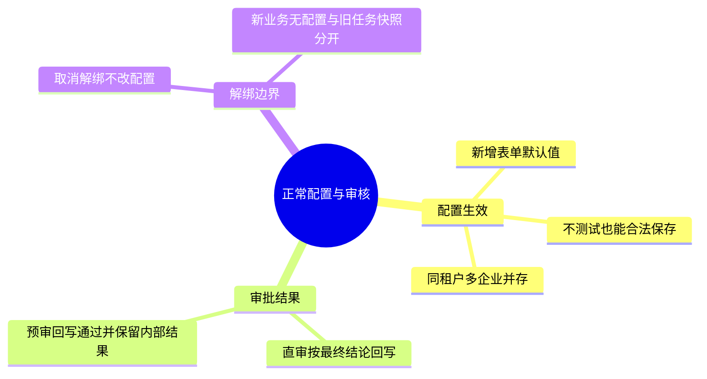

# 测试文档呈现优化方案（待审阅）

状态：仅为设计与效果样稿。本文不属于已部署 Skill，不能作为开始修改 Skill、模板或样板文档的指令。待用户审阅确认后再实施。

## 1. 已完成的回退

回退范围为此前呈现讨论中新增的脑图、Mermaid、长列表及 HTML 折叠相关规则：

- analyzing-change-for-testing/SKILL.md：移除新增的呈现方式总规则。
- test-analysis-template.md、test-basis-template.md、project-test-map-template.md、test-cases-template.md：恢复脑图讨论前的内容。
- docs/guide.md：移除“用图建立全貌，再查看明细”新增章节。
- 本地 .agents/skills 的对应 5 个文件同步恢复。

保留已批准的项目关联判断、连续推进、稳定命名、文档拆分、风险生命周期和原始证据保护。没有使用 Git 整文件还原或重置工作区。

maycur-ai-audit 的现有样板未在本轮修改，继续作为效果比较素材；其中的脑图与列表不代表本方案已获批准。

## 2. 目标与选择原则

让读者先找到关心的业务范围，再快速对照测试条件、检查重点和相关用例。信息形式由用途决定，不追求脑图数量或减少 Markdown 行数。

| 内容 | 拟采用形式 | 边界 |
| --- | --- | --- |
| 项目能力、需求范围、测试点层级概览 | Mermaid mindmap | 节点短且具体；过大时按业务拆图 |
| 完整测试点明细 | 按业务分组的精简 Markdown 表格 | 不退回重复长列表，不把全部明细挤进大脑图 |
| 具体测试 Case | Markdown 用例表格 | 每条 Case 有表格条目；复杂步骤在表后按 ID 展开 |
| 业务流程、分支与跨系统顺序 | 按需使用 Mermaid 流程图／时序图 | 只有关系确实难以线性解释时使用 |
| 条件与结果组合 | 决策表 | 保留精确预期及依据 |
| 风险状态、行动、证据索引 | 短表 | 长证据通过链接访问，状态有唯一维护位置 |

脑图可以展示简短测试点及编号，完整明细表仍保留全部已识别条件，支持逐项评审和设计。图只概括范围与关系，不再独立维护风险状态、执行结果或整套规则。

## 3. 样稿：正常配置与审核

下图是测试方向概览，不能当作已执行或已控制风险的声明：

明细保持表格。共同信息只说明一次：本组按产品承诺与已确认审批规则设计，安排为本轮先做；精确用例设计和执行条件仍见关联用例文件。

| 测试点 | 场景／条件 | 检查重点 | 关联用例 |
| --- | --- | --- | --- |
| TCON-HAPPY-01 | 首次打开新增配置表单 | 请求地址默认值正确；管理员工号可空；审批模式无默认值 | 待设计 |
| TCON-HAPPY-02 | 配置合法、企业编码未占用，未点击连通测试直接保存 | 保存成功，生成本租户有效配置及占用，列表可读 | CASE-CORE-01 |
| TCON-HAPPY-03 | 同租户、同产品新增第二家企业 | 两条配置并存，各企业单据使用对应配置 | CASE-CORE-02 |
| TCON-HAPPY-04 | 直审，无需人工，AI 通过且审核完成 | 内部通过，对外回写通过 | CASE-CORE-03 |
| TCON-HAPPY-05 | 直审，无需人工，AI 不通过且审核完成 | 内部不通过，对外回写不通过 | CASE-CORE-04 |
| TCON-HAPPY-06 | 预审，无需人工，AI 通过且审核完成 | 内部通过，对外回写通过 | CASE-CORE-05 |
| TCON-HAPPY-07 | 预审，无需人工，AI 不通过且审核完成 | 内部保留不通过，对外回写通过 | CASE-CORE-06 |
| TCON-HAPPY-08 | 在解绑确认中取消操作 | 原配置与占用保持不变 | 待设计 |
| TCON-HAPPY-09 | 解绑最后一条配置后发起新业务读取 | 新业务提示未配置；旧任务仍按原快照处理 | 待设计 |

该样稿沿用现有编号与规则，仅展示拟议排版。共同方法、安排和依据移出逐行重复文本；个别测试点有不同依据或安排时在该行注明，不能为简洁省掉差异。

## 4. 各文档的呈现安排

### 项目测试地图

能力概览可用脑图；业务与系统协作按需使用关系图。保留覆盖缺口、证据、项目风险和需求索引的短表。避免在图后再完整重复一张内容相同的大表。

### 需求测试分析

行动清单仍在文档前部。测试范围较复杂时增加脑图导航，随后按业务分组展示完整测试点表。共同风险依据、方法和安排写在组头；长源码证据与详细模型通过 basis 链接访问。既定七部分大纲不变。

### 测试用例

继续使用具体 Case 表格，明确前置、步骤、预期、依据和当前条件。复杂 Case 以表格摘要导航必要细节；按需补时序图解释切点。不能用脑图节点代替具体操作与断言。

### 测试依据与模型

保留能解释测试推导的实际模型，按关系选择状态图、流程图、时序图或决策表；原始资料仍引用源位置。不为每个工具强制画图。

## 5. 兼容性与可维护性

- 使用 Markdown 内的 Mermaid 文本源码，便于版本管理和修改。
- HTML details／summary 已在用户阅读器中显示为原始标签，新方案采用普通标题与表格。
- 阅读器不支持 mindmap 时，先验证其支持的文本图形式；仍不可用则用概览短表。测试点明细与 Case 表不受图渲染影响，不降级成长列表。
- 图中使用业务名称与必要 ID，图表关联可追溯。更新明细后核对图中的概括是否仍准确；风险状态和执行结果仍只在权威记录维护。
- 共同信息提到组头，但准确字段、边界、状态差异及判断依据保留。宽表问题通过业务分组、减少重复列和链接长依据解决。

## 6. 审阅通过后的最小实施范围

先确认本文的图与表样稿，再调整现有样板，确认用户阅读器实际显示正常，最后更新模板并同步本地。

只需修改四份现有模板及教程对应说明。SKILL.md 已指向模板，优先让具体呈现契约留在模板，不给主入口增加重复规则，也不新增视觉 Skill 或渲染框架。只有发现现有模板指针不能可靠触发时才另行提议改主文。

完成标准：范围可快速定位；测试点可逐行比较；Case 能找到操作和预期；没有原始 HTML 标签；图、明细、用例编号一致；原证据与未覆盖内容保留。使用当前真实样稿检查即可，不建立新的机械评测系统。

## 7. 编写与审计说明

writing-great-skills 的应用：呈现规则与对应模板放在一起，保留单一维护位置；说明选择条件和完成标准，避免多份 Skill 重复列举同一规则。用户讨论展示效果不自动授权修改已安装 Skill。

skill-eval 复核范围为呈现规则的回退和本提案。用户截图直接支持 HTML 折叠不兼容及长列表难对照；这属于交付需求与阅读器表现，不是模型过时证据。

| 观察 | 模式参考 | 证据强度与处理 |
| --- | --- | --- |
| 脑图、表格和列表规则散落主文与多个模板 | Group 2：重复信息；Group 1d：补丁堆积 | 有直接编辑历史；此次按用户请求回退。未来集中在对应模板 |
| HTML 折叠标签直接显示 | 输出契约与环境不匹配 | 用户截图可证实阅读器表现，不能外推所有阅读器 |
| 测试点改成长列表后难以比较 | Group 2：自由度配置不当 | 用户明确反馈；提议分组短表，待样稿审阅 |

目标模型版本和思考配置未在本次呈现审阅中锁定，也没有同模型前后对照。因此模型相关的“为什么过时”不作断言，模型特定判断为低置信度 flag；模型过时类建议 Diff 为空。当前回退源于明确用户授权，不以该 flag 为修改理由。

待审候选指令（产品呈现设计，不作为已验证的模型迁移 Diff）：

> 范围和层级概览优先使用 Mermaid 脑图。完整测试点按业务分组用精简表格，共同依据和安排在组头说明；具体 Case 用表格，复杂步骤在表后展开。图不替代明细和执行记录。先确认样稿的阅读效果，再修改并部署模板。

本轮没有应用上述候选指令，也未修改现有样板。新的实现须等待用户审阅确认。
